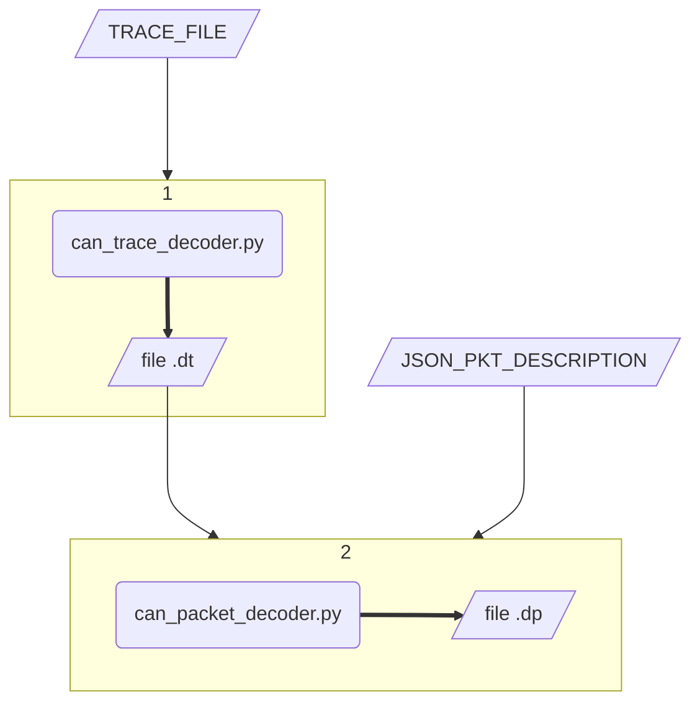

# OK-CAN

**O**verrated **K**it for CAN bus analysis.  
Just a collection of scripts mainly for decoding and related stuff ...

## How to run

Please download or clone locally the repository.

For decoding a CAN trace just to run the *decode* script via Linux shell or Windows prompt, passing the filepath of CAN raw traces and (optionally) the JSON file which describes the structure of the packet.

On Linux:  
```shell
./decode.sh <TRACE FILE> <JSON PKT DESCRIPTION>
```

On Windows:  
```dos
.\decode.bat <TRACE FILE> <JSON PKT DESCRIPTION>
```

At the end of the decoding process two files will be created:
 - **<TRACE FILE>.dt**: the list of decode traces
 - **<TRACE FILE>.dt.dp**: the list of decode packets, based on JSON description

## Demo

A sample CAN trace and JSON description is also provided as example.  
Run the command below:

```shell
./decode.sh sample_trace.csv sample_odometry_packet.json
```

## Documentation

The shell script **decode.sh** implements the following workflow:



Each Python script mentioned above has its specific goal and it can be run stand-alone. Detailed comments are provide on the source code, please read them carefully.

For command line usage, inputs and options show *help page*:

```shell
python3 <SCRIPT NAME> --help
```

#### can_trace_decoder.py

```text
Usage: python3 can_trace_decoder.py [FILE] [OPTION]...
Decode CAN trace extracting packets of each COB id.

An output file named FILE.dt is created at the end of decoding process.

Input [FILE] shall be compatible with the format below (sample):
"00:30:06.882","374","Std","","00 01 00 1A 02 C9 08 0A"
"00:30:06.883","374","Std","","28 02 02 02 02 02 02 00"
"00:30:06.883","374","Std","","30 00 02 02 02 00 00 1C"

  -v, --verbose            show detailed logging on the

Examples:
  $ python3 can_trace_decoder.py input.csv -v
```

#### can_packet_decoder.py

```text
Usage: python3 can_packet_decoder.py [FILE] [JSON-FILE] [OPTION]...
Decode CAN messages into application packets based on JSON-FILE description.

An output file named FILE.dp is created at the end of decoding process.

Input [FILE] shall be compatible with the format below (sample):
2024-06-07 00:30:32.015 ; 208  ; 85  ; 11     ; 54CB3CFFFEFFFFFFFFFF00
2024-06-07 00:30:33.025 ; 1FA  ; 123 ; 11     ; 020022041122334402000A1719000D2123
2024-06-07 00:30:32.042 ; 301  ; 227 ; 6      ; 30E20000E2B8

  -v, --verbose            show detailed logging on the

Examples:
  $ python3 can_packet_decoder.py input.csv odometry_packet.json -v
```

### JSON-FILE description

The goal of JSON files is to make easier (for the final user) to get packets decoded at *application level*.

Currently a JSON file describes how to decode only a single packet. For multiple packets the user has to build separate JSON for each ones.

The JSON has some general parameters like:
 - COB
 - endianess
 - minimum length of the packet
 - maximum length of the packet

 and a "decode" section where to explain how to decode byte after byte.

 Three kind of fields are currently available:
  - FIXED
  - DYNAMIC
  - BLOCK

#### Example

Packet structure (usually provided via SW docs):

TAB.1  
| Position | Name | Size | Range and Units | Description |
|----------|------|------|-----------------|-------------|
| 0 | CODE | 1 byte | enumerative | 00 : ack<br>01 : sensor status<br>02 : odometry info |
| 1 | LEN | 2 bytes | 3..1024 | Total length of message (bytes) |
| 3 | TIME_LEN | 1 byte | 1..4 | Length of field TIME (following) |
| 4 | TIME | - | .. ms | Time from power up in ms |
| - | N_DATA_GROUP | 1 byte | 0..7 | N of groups containing specific info.<br>Each group has a specific subfields. |
| - | DATA_GROUP_x | - | - | Collection of data as described TAB.2 |

TAB.2 Data groups  
| Position<br>(relative) | Name | Size | Range and Units | Description |
|------------------------|------|------|-----------------|-------------|
| 0 | POSITION | 2bytes | -5000 .. +5000 Km | Object position |
| 2 | TILT_X | 1 byte | -90° .. +90° | Rotation on X axis |
| 4 | TILT_Y | 1 byte | -90° .. +90° | Rotation on Y axis |

Corresponding JSON description:

```json
{
    "cob" : "1FA",
    "endianess" : "BIG",
    "min_length" : 3,
    "max_length" : 1024,
    "decode" : 
        [
            {
                "type" : "FIXED",
                "length" : 1,
                "name" : "CODE"
            },
            {
                "type" : "FIXED",
                "length" : 2,
                "name" : "LEN"
            },
            {
                "type" : "DYNAMIC",
                "length" : 1,
                "name" : "TIME"
            },
            {
                "type" : "BLOCK",
                "length" : 1,
                "name" : "GROUP",
                "subfields" : 
                    [
                        {
                            "type" : "FIXED",
                            "length" : 2,
                            "name" : "POSITION"
                        },
                        {
                            "type" : "FIXED",
                            "length" : 1,
                            "name" : "TILT_X"
                        },
                        {
                            "type" : "FIXED",
                            "length" : 1,
                            "name" : "TILT_Y"
                        }
                    ]
            }
        ]
}
```

## Licensing

The **OK-CAN** software is licensed under the [MIT License](https://choosealicense.com/licenses/mit/).  
Please refer to LICENSE file for further details.

## TODO

- [x] Add conversion from generic sample trace
- [x] Add JSON structure for decoding
- [ ] Manage endianess
- [ ] Add JSON field-data conversion (make it optional)
- [ ] Add conversion from ODBC to your generic JSON (maybe next year..)